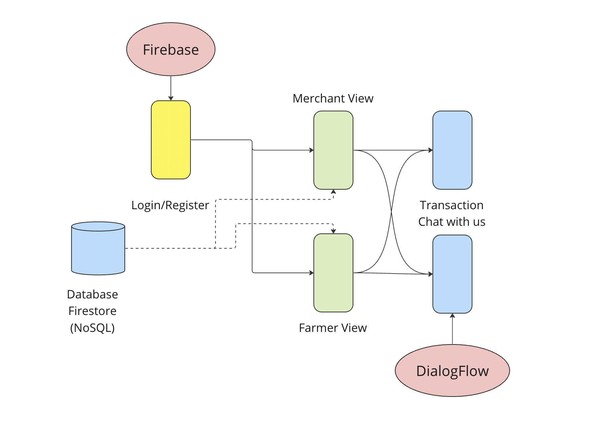
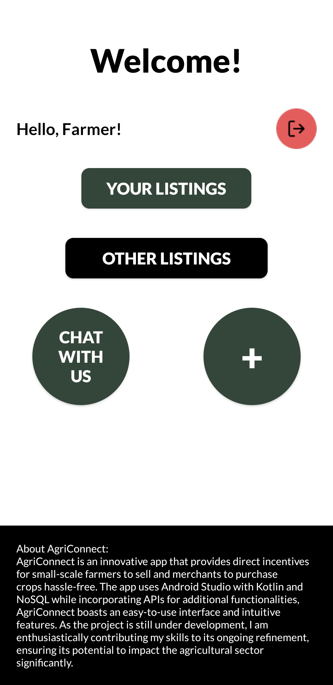
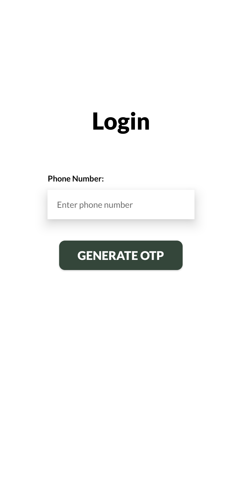
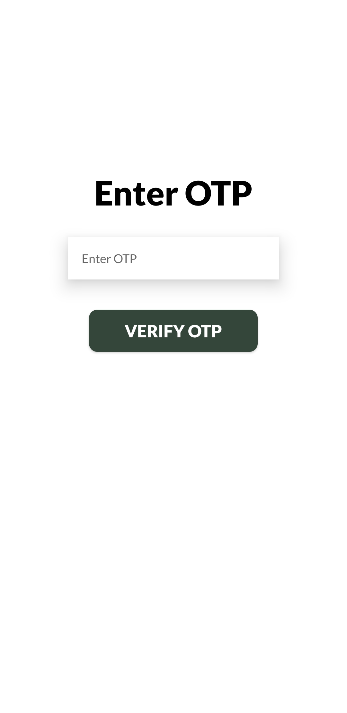
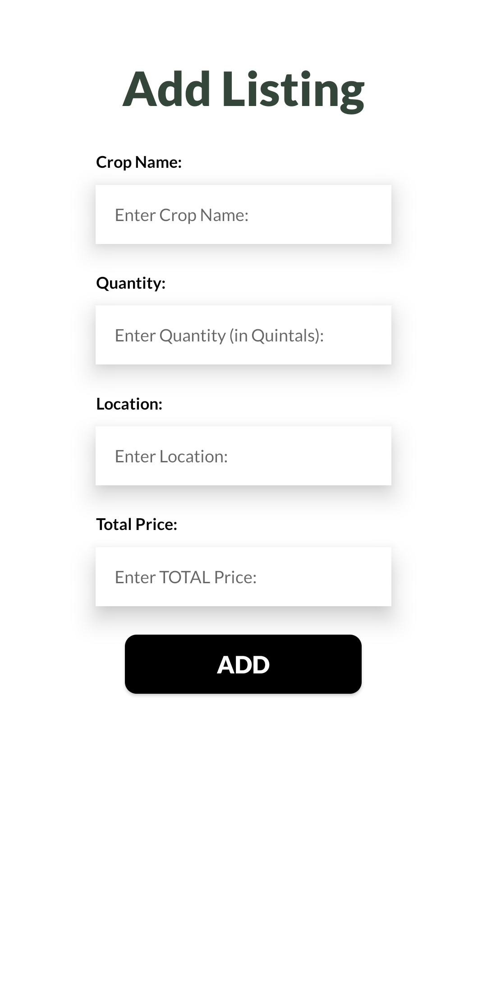
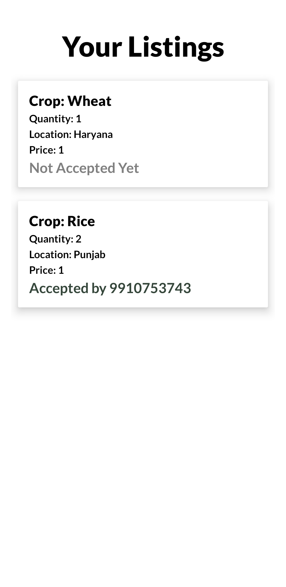
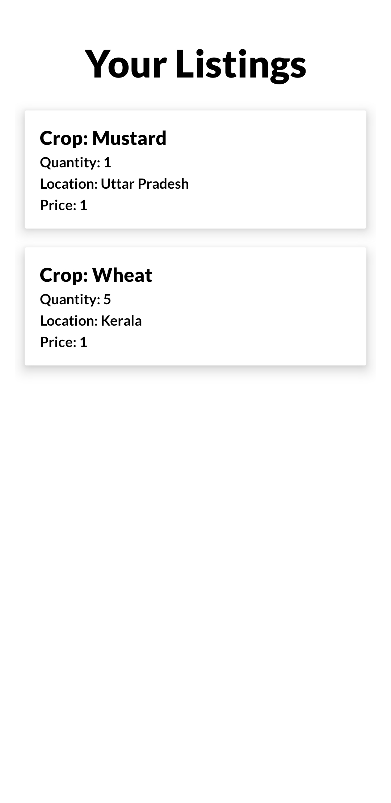
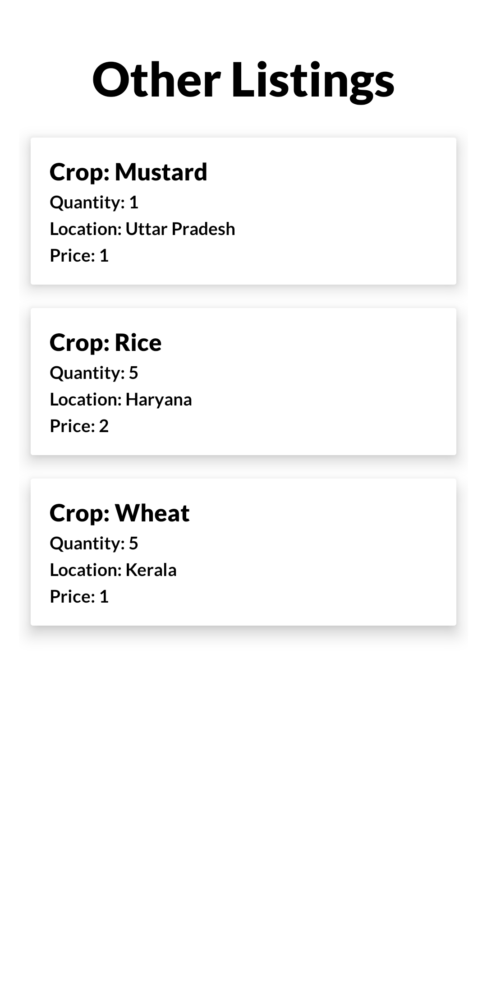
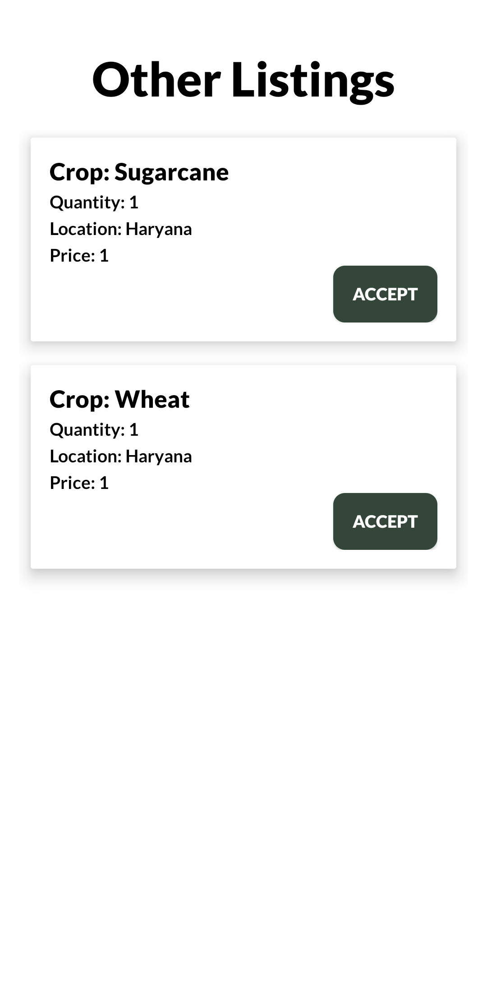
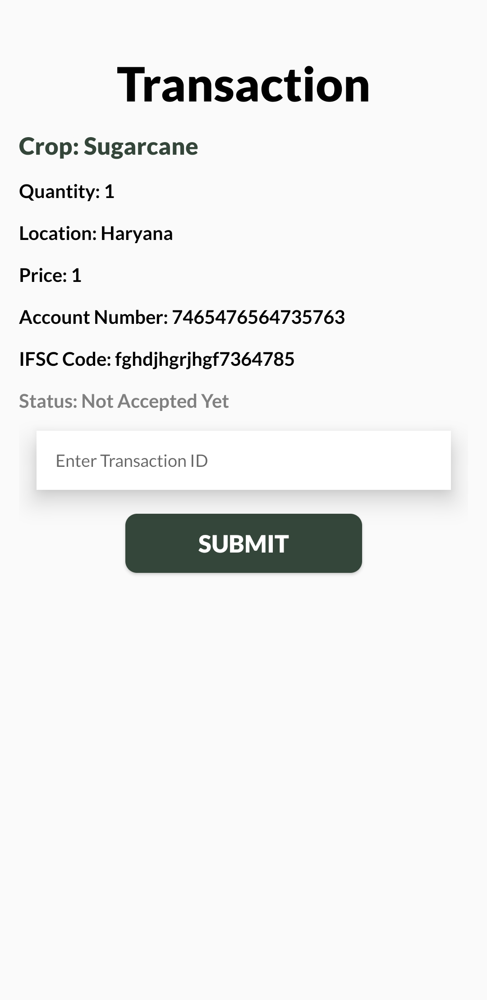

# AgriConnect
AgriConnect is an innovative app that provides direct incentives for‬ small-scale farmers to sell and merchants to purchase crops hassle-free.‬ The app uses Android Studio with Kotlin and NoSQL while incorporating‬ APIs for additional functionalities. AgriConnect boasts an easy-to-use‬ interface and intuitive features.

## Technologies Used

## Download the App
> You can download the app safely through [this link](app-debug.apk).

## Architecture Diagram

Overview of the app's architecture.

## App Screenshots

### Home Screen

The main landing page of the app.

### Login Screen

Login page for user authentication.

### OTP Verification

OTP verification screen for secure login.

### Add Listing

Interface for adding new listings to the platform.

### Your Listings - Farmer

View of listings posted by a farmer.

### Your Listings - Merchant

View of listings posted by a merchant.

### Other Listings - Farmer

Listings available for the farmers.

### Other Listings - Merchant

Listings available for the merchants.

### Transaction Screen

Screen for handling transactions within the app.

<!-- Trigger reindex -->

